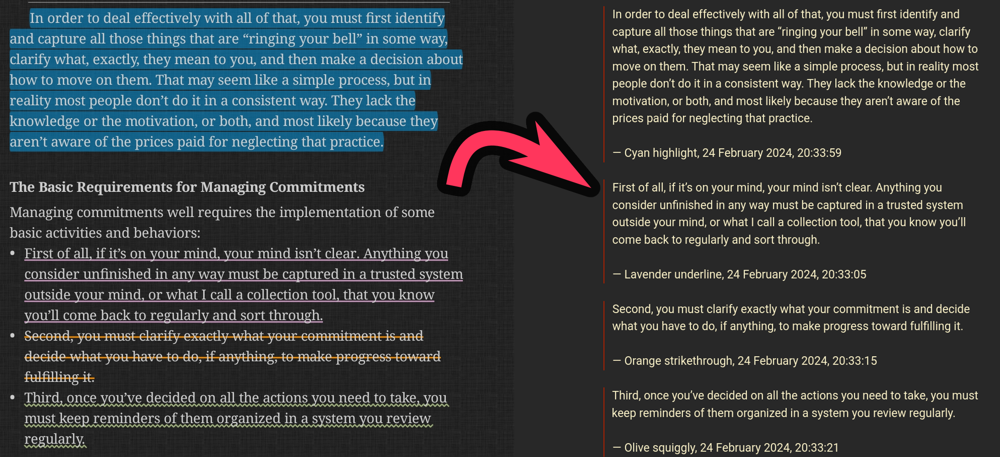

# Moon+ Reader Highlight Extractor

Extract Moon+ Reader highlights (from a mrexpt file), and place its contents into a markdown file.



## Generating the mrexpt file

Before running this program, you need to create a mrexpt file, that contains all the data related to the highlights. To do this:

1. Open Moon+ Reader on your phone/tablet
2. Open the book with the highlights you want to extract
3. Click on the middle of the screen, to open a menu
4. Click on the "chapters" icon at the bottom of the screen (the icon with 3 lines and 3 dots)
5. Go to "bookmarks", at the top of the screen
6. Click on the "Share" icon at the bottom left of the screen
7. Click on "Export list to file"
8. Choose the location you want to save, click on "OK"
9. Copy the file you just created to your computer

## Installation

Before installing this program, make sure you have python (version 3.9 or above) and git installed.

To download and use it, run first the following command:
```
git clone https://github.com/Guilherme-Natan/MoonReader-Highlights-Extractor.git
cd MoonReader-Highlights-Extractor/
```

## Usage

You will need to run a command with the following structure:
```
python3 moonreader.py <path_of_mrexpt_file>
```

After that, the script will create a new markdown file, in the same directory as it is installed. It will have the same basename as the mrexpt file, and a `.md` extesion.

### Examples

If you want to extract the highlights from a file called "Getting Things Done.mrexpt", place this file in the same directory as the "moonreader.py" script, and run the following command:

```
python3 moonreader.py "Getting Things Done.mrexpt"
```

After that, a `Getting Things Done.md` file will be created, also in the same directory as the script.
